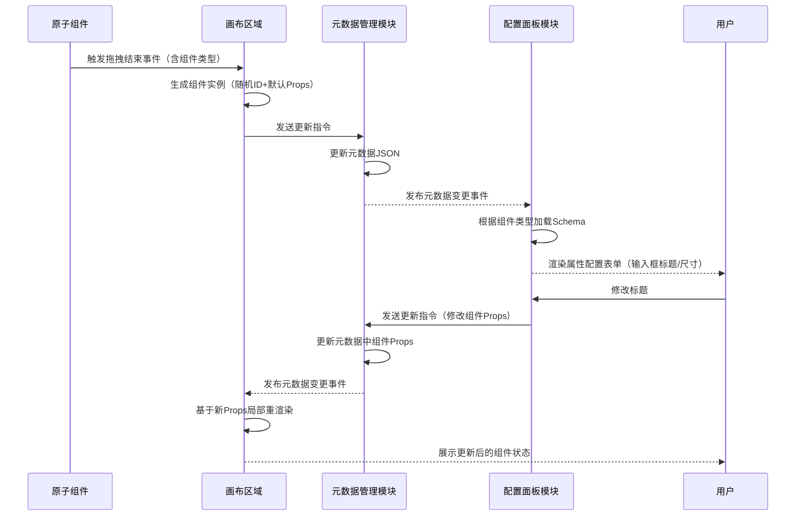

## 一 个人主要职责

介绍姓名：黄金鹏
部门：京东云事业部-企业服务业务部-产品与研发部-前端研发组
职位：软件开发
职责：负责标审业务前端开发，参与 AI E2E 系统建设
入职日期：2025.08.03
过往经历：2022.06 本科毕业，2022.07 - 2025.07 在快手数据平台产品技术中心，负责流量方向的业务开发和埋点工具的建设

## 二 试用期工作成果总结

### 2.1 回顾目标

1.业务支持：熟悉团队开发流程（需求评审→编码→测试→部署），交付 5+ 业务需求，确保代码符合团队规范；线下 bug 数不高于 2 个 / pd。

2.技术升级：完成面客端的仓库迁移、前端代码重构；结合 AI 工具转化代码，使用率不低于 20%。

3.质量保障：熟悉自动化测试工具；Chrome 插件 Recorder 模块集成。

### 2.2 工作成果

#### 2.2.1 业务需求高效交付与模板工具建设

* 交付 5+ 业务需求，线下 bug 率控制在 1 个 /pd；
* 核心参与模板工具建设，支持 5+ 原子组件，为后续作业配置的灵活性、扩展性奠定了基础；
* 熟练掌握团队开发流程，沉淀了众智开发白皮书私有化部署实践 - 替换logo；
* BPO外卖C端采集项目提效上线后，作业员工手动修改频次降低，目前 10% 左右修改率；

### 2.2.2 前端项目技术架构升级与工程化落地

* 迁移面客端部署至生产环境。使用配置化组件，整体样式符合团队 UI 规范；
* 完成脚手架改造，内置登录、菜单、自定义权限、常用组件等功能，为后续各端项目初始化提供了保障；
* 通过原子类替代手写 CSS，预计样式代码量减少 20%（总 style 行数 / vue 文件总代码行数）；
* monorepo 落地后，标审业务面客端、运管端项目维护成本降低 50%（跨项目修改从 “改 2 处” 变为 “改 1 处”）；

### 2.2.3 AI E2E 系统功能完善

* chrome插件：完成单条语句的保存，支持脚本的数据解析和保存；
* server：新增批量添加语句接口，输出执行日志；

### 2.3 重点事项

#### 2.3.1 模板工具建设

**背景：** 众智现有项目有多个工具，其中综合快判Pro工具使用频率最高。作业配置需要进行一系列表格、表单操作，存在配置不够灵活，流程不够简化等痛点。
**目标：** 提供模板工具，支持直接拖拽原子组件(字段组件、答题组件)到画布中，并调整属性和内容，生成项目可复用的模板配置。
**执行内容：**

1.原子组件建设：字段组件(文本、链接、图片、音频、视频等)，答题组件(输入框、单选框、多选框、下拉框、上传图片等)，每个组件定义“配置 schema”，用于生成内容配置面板（如：视频组件的自动播放、静音播放、循环播放等配置）；


（视频组件配置）

2.拖拽画布：

中间：画布区域（接收拖拽的原子组件，支持组件移动、删除、层级调整）。

右侧：配置面板（选中组件后，根据组件的 schema 动态生成表单，修改后同步更新画布组件）。

画布组件状态与元数据双向绑定，做到修改配置面板 → 更新元数据 → 重新渲染画布。

以「拖拽组件并同步属性」为例，展示核心模块间的实时数据流转：



[模板工具演示.mov](https://apijoyspace.jd.com/v2/pages/0TMAhzsCxh7xeHZbsptL/files/0VTiutPkhq3WDU5V60Eh/link)

#### 2.3.2 面客迁移重构

**背景：** 既有项目存在架构老旧、多项目维护成本高（标审业务涉及面客端、运管端、模板等多个关联项目，代码仓库分散）、CSS 开发效率低（手写大量重复样式）的问题，影响迭代速度。

**目标：**主导众智面客端迁移重构，并落地工程化配置，为后续标审全平台产品重构奠定基础。

**执行内容：**

1.项目迁移与部署：主导面客项目向新架构迁移，升级相关依赖，编写迁移 CheckList，完成生产环境部署全流程（nginx配置、反向代理、域名申请）。


（面客新旧部署架构图）

2.代码规范与工程化：

* 配置 JoyCode rules，利用 AI 批量改造旧代码，辅助重构；


（统一替换 axios 请求）

* 引入 Tailwind CSS，大幅减少手写 CSS 的成本；


（m端图片上传组件）

* 采用 pnpm+monorepo 管理标审业务的关联项目，统一依赖版本（通过 pnpm workspace）、共享工具函数（内部 package）。

```
fe-bpo/
├── .joycode/
│   ├── prompt.json
│   └── rules/
│       └── fe-bpo.mdc
├── apps/               # 应用入口类
│   ├── app-bpo-biao-platform/    # 面客端
│   ├── app-bpo-las-management/   # 运管端
│   └── ...
├── packages/
│   ├── bpo-template/  # 模板工具
│   │   ├── template-168/  # 综合Pro
│   │   ├── template-192/  # 3D
│   │   ├── template-193/  # 2D
│   ├── components/  #  通用组件
│   ├── utils/  #  通用工具函数
│   ├── constants/  # 通用常量
│   ├── bpo-shared/  # 面客、运管等平台复用
│   │   ├── pages/  #  复用页面
│   │   ├── components/  #  复用组件
├── pnpm-lock.yaml
├── pnpm-workspace.yaml
├── tailwind.config.js  # tailwindcss配置
└── package.json        # 根工作区配置
```

## 三 综合自评

### 优势：

* **以用户体验为核心：**不满足于仅实现业务功能，而是从前端交互细节切入，解决用户实际使用痛点。例如：表格组件开发中，发现“多行选择时热区仅局限于复选框”，调整热区覆盖整行单元格，提升用户操作效率。
* **前端工程化：**针对项目工程中的“规范不统一、依赖管理混乱”问题，将工程化规范拆解为具体技术落地动作。例如：面客系统迁移过程中，引入 Tailwind CSS 并配置项目专属主题（如业务色值、组件尺寸变量），采用"pnpm+monorepo"架构管理多模块代码，提升开发效率。
* **跨团队高效协作：**主动对齐产品、后端、测试等多角色需求，通过前端技术手段提前化解协作卡点。例如：采集项目提效需求中，基于 Node.js 结合 OSS SDK 快速开发“预签名 URL 生成脚本”，模拟后端签名逻辑生成临时访问链接，支撑前端文件上传流程跑通。

### 待提升：

* **AI 赋能：**AI 结合业务和研发场景的应用深度不足。提升计划：通过团队内部分享的课程系统学习，探索 AI 辅助作业提效与 E2E 测试，并落地相关场景。

## 四 未来的发展与规划：

**1.核心产品力建设：**

新作业平台：支持标审全平台产品完成重构，预计Q4完成 MVP 版本，明年Q1全面完工。结合业务价值和技术成本，在需求评审时主动提出合理建议，建立业务认知体系；核心参与模板化工具建设，通过优化答题组件交互，持续提升用户体验。

旧作业平台：支持众智私有化部署；持续跟进线上问题反馈&解决；Q4结束，推动新面客(前端重构)，由部分业务试用到全量切换使用。

**2.AI 赋能：**

AI 预标注：探索 AI 预标注能力，2026H1尝试至少在 1 个项目场景落地，辅助作业提效。

AI E2E：完善系统功能以支撑基础测试场景，2026H1尝试在标审业务，跑通答题页面的线上巡检，做到提前发现线上故障，减少业务损失。


